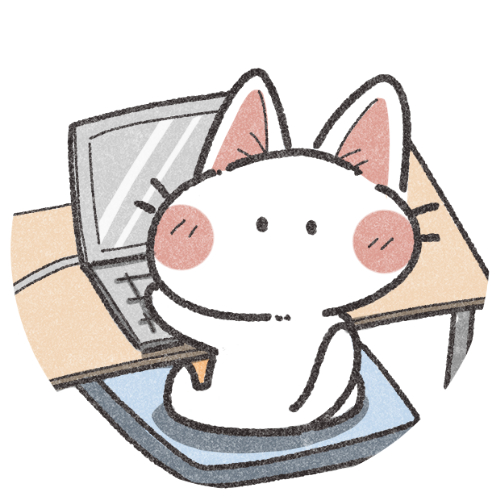

<!-- ░░░░░░░░░░░░░░░░░░░░░  HEADER  ░░░░░░░░░░░░░░░░░░░░░ -->
<div align="center">

<a href="https://github.com/kenshin-morioka">
  
</a>


</div>

<!-- ░░░░░░░░░░░░░░░░░░░░░  ABOUT  ░░░░░░░░░░░░░░░░░░░░░ -->

### 🛠 About me

```yaml
name:        Kenshin Morioka
role:        Backend Engineer
hacking_on:
  - personal Rust 🦀 projects
daily_driver:
  terminal: WezTerm
  mux:      tmux
  editor:   Neovim (LazyVim)
  shell:    zsh
interests:   [backend, data-engineering, infra-as-code, rust, dx]
```

<!-- ░░░░░░░░░░░░░░░░  DAILY DRIVER  ░░░░░░░░░░░░░░░░ -->

### ⚙️ Daily Driver

<div align="center">


</div>

```text
 wezterm  ──  tmux 0:rust* 1:rails 2:zsh  ──  nvim  src/main.rs ────────
~/projects/awesome-rust $ cargo run
   Compiling awesome v0.1.0 (/Users/kenshin/projects/awesome-rust)
    Finished dev [unoptimized + debuginfo] target(s) in 1.34s
     Running `target/debug/awesome`
ship it 🦀
```

<!-- ░░░░░░░░░░░░░░░░  CONTRIBUTION SNAKE  ░░░░░░░░░░░░░░░░ -->

<div align="center">
  <picture>
    <source media="(prefers-color-scheme: dark)"  srcset="https://raw.githubusercontent.com/kenshin-morioka/kenshin-morioka/output/github-snake-dark.svg" />
    <source media="(prefers-color-scheme: light)" srcset="https://raw.githubusercontent.com/kenshin-morioka/kenshin-morioka/output/github-snake.svg" />
    
  </picture>
</div>

<!-- ░░░░░░░░░░░░░░░░░░░░░  STATS  ░░░░░░░░░░░░░░░░░░░░░ -->

<div align="center">


</div>

<!-- ░░░░░░░░░░░░░░░░░░░░░  STACK  ░░░░░░░░░░░░░░░░░░░░░ -->

### 🧰 Tech Stack

<div align="center">


</div>

<!-- ░░░░░░░░░░░░░░░  ACTIVITY GRAPH  ░░░░░░░░░░░░░░░ -->

<div align="center">
  
</div>

<!-- ░░░░░░░░░░░░░░░░░░░░  QUOTE  ░░░░░░░░░░░░░░░░░░░░ -->

<div align="center">
  
</div>

<!-- ░░░░░░░░░░░░░░░░░░░░  FOOTER  ░░░░░░░░░░░░░░░░░░░░ -->

<div align="center">

<sub>パソコンにゃんこ ♡</sub><br/>


</div>
