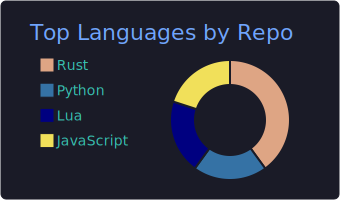
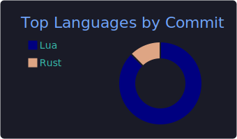

<!-- ░░░░░░░░░░░░░░░░░░░░░  HEADER  ░░░░░░░░░░░░░░░░░░░░░ -->
<div align="center">

<a href="https://github.com/kenshin-morioka">
  
</a>

</div>

<!-- ░░░░░░░░░░░░░░░░░░░░░  ABOUT  ░░░░░░░░░░░░░░░░░░░░░ -->

### 🛠 About me

```yaml
name:        Kenshin Morioka
role:        Backend Engineer
hacking_on:
  - personal Rust 🦀 projects
daily_driver:
  terminal: WezTerm
  mux:      tmux
  editor:   Neovim
interests:   [backend, data-engineering, infra-as-code, rust, data-science]
```

<!-- ░░░░░░░░░░░░░░░░░░░░░  STATS  ░░░░░░░░░░░░░░░░░░░░░ -->

<div align="center">





</div>

<!-- ░░░░░░░░░░░░░░░░░░░░░  STACK  ░░░░░░░░░░░░░░░░░░░░░ -->

### 🧰 Tech Stack

<div align="center">


</div>

<!-- ░░░░░░░░░░░░░░░  ACTIVITY GRAPH  ░░░░░░░░░░░░░░░ -->

<div align="center">
  
</div>

<!-- ░░░░░░░░░░░░░░░░░░░░  FOOTER  ░░░░░░░░░░░░░░░░░░░░ -->
